```{r setup, include=FALSE}
bslib::bs_themer()
if (requireNamespace("thematic")) 
  thematic::thematic_rmd(font = "auto")
```

#### [Lizzy Gamboa](https://www.linkedin.com/in/kalizzygam/)

# Hablemos de estadística

# Distribuciónes de probabilidad

La estadística descriptiva que se encarga de organizar, tabular, resumir, graficar y presentar los datos tomados de eventos pasados (encuestas, ventas de un establecimiento, etc.) de manera informativa.

La estadística inferencial que se encarga de realizar el cálculo de la probabilidad de que algo ocurra en el futuro.

En el mundo actual, al momento de tomar una decisión, muy rara vez contamos con la información completa para hacerlo, es por eso que la inferencia estadística juega un papel fundamental en este caso, ya que a partir de una muestra significativa de una población (información limitada), inferimos propiedades de esta población y utilizando la teoría de probabilidades podemos analizar riesgos y reducirlos al mínimo.

```{r echo=FALSE,fig.align='center', out.width='600pt'}
knitr::include_graphics("img/CicloInferencia.jpeg")
```


Los modelos de probabilidad, que son representaciones de la realidad, pueden ayudarnos a optimizar la ganancia de un negocio, optimizar inversiones, optimizar el sistema del servicio al cliente de una compañía creando políticas para evitar la pérdida de clientes, desarrollar mejores programas sociales y políticas públicas y hasta crear nuevas estrategias competitivas a largo plazo según el mercado.


Ahora bien, entonces ¿qué es exactamente la probabilidad? La probabilidad es un valor entre 0 y 1 que describe la posibilidad de ocurrencia de un acontecimiento, dónde  [1 representa que el acontecimiento sucederá muy seguramente y 0 que el acontecimiento con seguridad no sucederá.]()


```{r echo=FALSE,fig.align='center', out.width='600pt'}
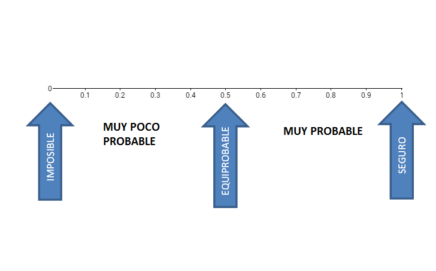
```


**Ejemplos: **

```{r echo=FALSE,fig.align='center', out.width='600pt'}
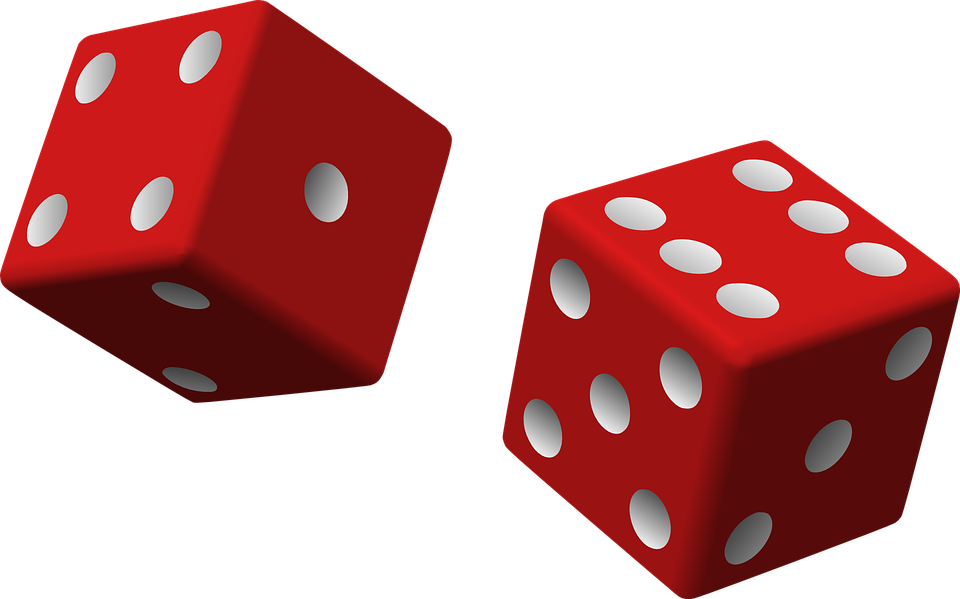
```


```{r echo=FALSE,fig.align='center', out.width='600pt'}
knitr::include_graphics("img/bolasejemplo.png")
```

**¿Qué pasa con las variables continuas? **

Esta gráfica representa los resultados de una encuesta sobre cociente intelectual...


```{r echo=FALSE,fig.align='center', out.width='600pt'}
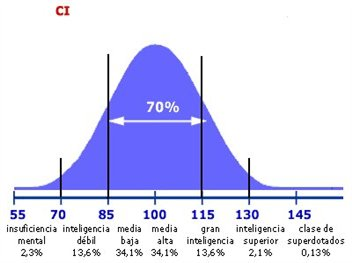
```


Teniendo presente los conceptos anteriores, podemos definir de una manera no formal una distribución de probabilidad como una lista que nos proporciona todos los resultados de los valores que pueden presentarse en un acontecimiento, junto con la probabilidad de ocurrencia asociada a cada uno de estos valores.

Y para poder tener una distribución de probabilidad debemos tener una [Variable Aleatoria]() 

## Variable Aleatoria

Una variable aleatoria es una función que asigna un valor numérico, al resultado de un experimento aleatorio. Una variable aleatoria puede ser discreta o continua. Las variables aleatorias discretas son aquellas que presentan un número contable de valores; por ejemplo, el número de personas que viven en una casa (pueden ser 3, 5 o 9). Las variables aleatorias continuas son aquellas que presentan un número incontable de valores; por ejemplo, el peso de las vacas en una granja (una vaca puede pesar 632,12 kg, otra puede pesar 583,12312 kg, otra 253,12012 kg, otra 198,0876 kg y nunca terminaríamos de enumerar todos los posibles valores). Como estas definiciones son muy difíciles de entender a simple vista, vamos a explicarlas a detalle.


Una variable aleatoria es una función que asigna un valor numérico, al resultado de un experimento aleatorio. Recordemos que el resultado de un experimento aleatorio depende del azar. Veamos los ejemplos.


### Ejemplo 1: Variable discreta


Tenemos una moneda que en sus caras tiene por un lado un gato y por el otro, un perro.


```{r echo=FALSE,fig.align='center', out.width='500pt'}

```

Vamos a realizar un experimento aleatorio que consiste en lanzar 2 monedas. Colocaremos los resultados en el siguiente gráfico:

```{r echo=FALSE,fig.align='center', out.width='500pt'}

```

Definimos nuestra variable aleatoria X:

$X$ = número de perros.

```{r echo=FALSE,fig.align='center', out.width='500pt'}
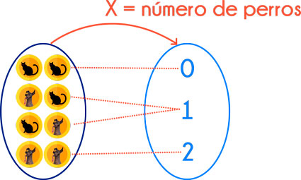
```


Ten en cuenta que la variable aleatoria siempre va con letras mayúsculas (en este caso X), mientras que los valores de su rango siempre con letras minúsculas (en este caso x1  , x2 , x3).

```{r echo=FALSE,fig.align='center', out.width='500pt'}
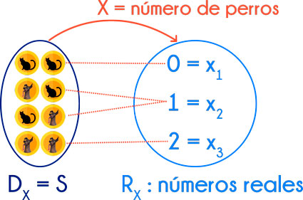
```


Los valores del rango de esta variable aleatoria son:

* $x_1$ = 0
* $x_2$ = 1
* $x_3$ = 2


En el dominio de la función tenemos el espacio muestral, es decir, todos los resultados posibles de nuestro experimento aleatorio. Mientras que el rango tenemos un conjunto de números reales.


### Ejemplo 2: Variable discreta 

En un banco hay 3 cajeros automáticos. Vamos a realizar un experimento aleatorio que consiste en ir al banco a una hora al azar del día y ver qué cajeros están ocupados y qué cajeros están vacíos.

Colocamos en el siguiente gráfico los resultados, los cajeros vacíos (V) irán de color rojo y los ocupados (O) de color verde.


```{r echo=FALSE,fig.align='center', out.width='500pt'}
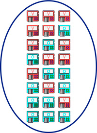
```


Definimos nuestra variable aleatoria Y:

* $Y$ = número de cajeros automáticos ocupados.

```{r echo=FALSE,fig.align='center', out.width='500pt'}
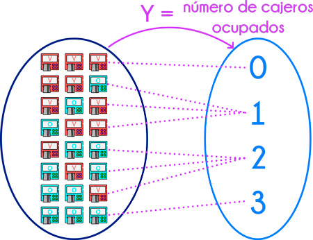
```


Ten en cuenta que la variable aleatoria siempre va con letras mayúsculas (en este caso Y), mientras que los valores de su rango siempre con letras minúsculas (en este caso  $y_1  , y_2 , y_3, y_4$ ).

```{r echo=FALSE,fig.align='center', out.width='500pt'}
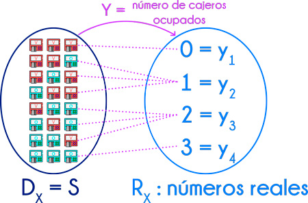
```


Los valores del rango de esta variable aleatoria son:

* $y_1$ = 0
* $y_2$ = 1
* $y_3$ = 2
* $y_4$ = 3

Las variables aleatorias se clasifican en discretas o continuas en función de los valores numéricos que asumen. Veamos esto a detalle. 


### Ejemplo 1: Variable continua 


Una variable aleatoria continua, es aquella que puede asumir un número incontable de valores.

Por ejemplo, si realizamos el experimento de ir a mi granja y estudiamos las características de las vaquitas, podemos definir la variable aleatoria C:

* $B$ = peso de una vaca en la granja de Jorge (en kilogramos).

Alguna vaquita puede pesar 425,1872 kg; otra puede pesar 612,5874541 kg; otra puede pesar 545,897512121 kg. Si tomamos más vacas, podríamos tener más valores y nunca terminaríamos. 

Se conoce que el becerro más pequeño tiene un peso de 30 kg, y la vaca más grande tiene un peso de 1000 kg.

```{r echo=FALSE,fig.align='center', out.width='600pt'}
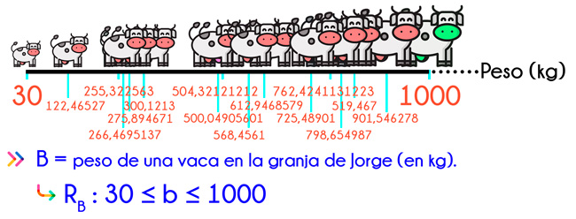
```


Y así, tendríamos un número incontable de valores para el rango de esta variable. El rango de esta variable puede ser cualquier valor dentro del intervalo que va desde 30 kg hasta 1000 kg. 

Por ello, se trata de una variable aleatoria continua. 


### Ejemplo 2: Variable continua 

Si vamos a una agencia del banco y registramos los datos de atención a los clientes, podemos definir la variable aleatoria... Si! Tambien esto lo podemos volver una variable aleatoria. 


* $D$ = tiempo de atención a los clientes del banco (en segundos).


Un cliente puede ser atentido en 24,123 s; otro cliente en 72,32142 s; otro en 51,123123 s. Si seguimos tomando más clientes, tendríamos más valores. Se conoce además que el tiempo mínimo de atención en ventanilla es de 1 s y el tiempo máximo es de 240 s.

```{r echo=FALSE,fig.align='center', out.width='600pt'}
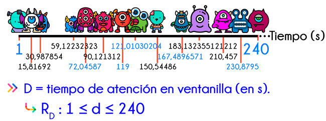
```


Y así, tendríamos un número incontable de valores para el rango de esta variable. El rango de esta variable puede ser cualquier valor dentro del intervalo que va desde 1 s hasta 240 s. Por ello, se trata de una variable aleatoria continua. 

En general, las variables aleatorias discretas representan datos que provienen del conteo del número de elementos, mientras que, las variables aleatorias continuas representan datos que provienen de mediciones, por ejemplo, tiempo, peso, longitud, etc. 


Ahora que hemos entendido lo que es una variable aleatorio y lo que hace una función de probabilidad, podemos hablar de familias paramétricas :D 


# Familias Paramétricas


# Pruebas de hipótesis

Una hipótesis es una **proposición que puede o no ser verdadera** pero que se adopta provisionalmente hasta recabar información que sugiera lo contrario. Si hay inconsistencia, se rechaza la hipótesis. Las pruebas de hipótesis se usan precisamente para **evaluar el grado de esa inconsistencia**.


Se puede describir formalmente los pasos a seguir:

#### Formular la hipótesis y su alternativa ($H_0 \quad Vs \quad H_1$):

Normalmente la hipótesis de trabajo (por ejemplo, tal tratamiento es mejor que el control o tal procedimiento tiene menos morbilidad) es contrastada con una hipótesis estadística que supone que no existe tal efecto o tal diferencia. La razón para hacer esto es que se puede calcular de antemano la distribución de probabilidades asociadas con tal situación. Esta hipótesis se conoce con el nombre de hipótesis nula que se abrevia como $H_0$ (Nullus: Nula, falto de valor y fuerza para obligar o tener efecto). La expresión matemática es $H_0: \mu_1 = \mu_2$ La hipótesis alternativa es que el efecto sí existe, que es distinto de cero, y que en algunos casos se puede especificar el signo de esa diferencia. Normalmente corresponde a la hipótesis de trabajo, se abrevia como $H_1$ y tiene tres alternativas: 

* $\mu_1 \neq \mu_2$
* $\mu_1<\mu_2$
* $\mu_1>\mu_2$

#### Determinar prueba adecuada

Elegir la prueba estadística apropiada de acuerdo al diseño experimental, el tipo de datos y el número de grupos que se comparan. La cifra que resulta de usar la prueba (aplicar la o las fórmulas) en los datos recolectados se conoce como el estadístico del test en cuestión: **z**; estadístico **t** o t de Student, la **r** de Pearson, **F** del análisis de varianza. La distribución del estadístico puede ser calculada de antemano cuando la $H_0$ es verdadera y por lo tanto conocer los valores que delimitarán distintas porciones del área bajo la curva de esa distribución; éstas se conocen como distribuciones de muestreo. Vale la pena decir aquí, y lo reiteraremos luego, que **las pruebas de hipótesis en ningún caso prueban la veracidad de la hipótesis alternativa o de trabajo**, limitándose a decir que no hay suficiente evidencia para rechazar la hipótesis nula basándose en un nivel preestablecido de probabilidades.

#### Elegir el nivel de significancia $\alpha$

Se trata del límite tolerado para rechazar $H_0$. En general, se usa $\alpha=0.01, \quad \alpha=0.05 \quad ó \quad \alpha=0.1$, cifras que implican un 1%, 5% o un 10% respectivamente, de posibilidades de equivocarse cuando se rechaza $H_0$, de decir que hay una diferencia cuando en realidad no la hay. Este es el llamado **error tipo I**.

#### Calcular el valor de P (p-value)
Esta es la **probabilidad de obtener los resultados observados u otros más extremos** si la $H_0$ es verdadera, cifra que es determinada por el área de la distribución que queda más allá del valor calculado.

#### Decisión

Si $p < \alpha$, rechazar $H_0$ en favor de la alternativa; en caso contrario, no se rechaza la hipótesis nula. El conjunto de valores que resultarían en el rechazo de $H_0$ – calculados conociendo la prueba usada, $\alpha$ y el número de observaciones – se conoce con el nombre de **región crítica**. Este punto puede refrasearse así: "**Se rechaza la $H_0$ si el estadístico cae en la región crítica"**. En los apéndices de los textos de estadística aparecen tablas con la distribución de estos estadísticos, dando el valor de **p** (p-value) y donde el tamaño de la muestra se considera en los grados de libertad.

```{r echo=FALSE,fig.align='center'}
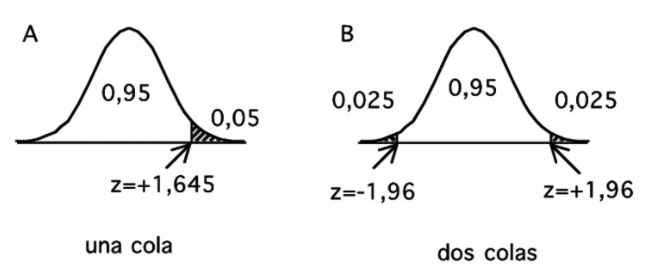
```

Como se evalúa el estadístico calculando la probabilidad de observar el valor encontrado u otro más extremo, el valor de P constituye la cola de la distribución. Este concepto es importante pues permite entender qué significa un test de una cola o de dos colas. 

Si la hipótesis de trabajo implica que existe una diferencia, sin especificar la dirección de esa diferencia ($\mu_1 \neq \mu_2$) debe usarse una prueba de dos colas. Si se es capaz de especificar de antemano el signo de ella ($\mu_1 < \mu_2$ o bien $\mu_1 > \mu_2$), se puede y se debe usar una prueba de una cola. 

El punto es importante pues el área crítica es mayor en este último caso lo que equivale a decir que se puede rechazar con un valor menor del estadístico. 

## Errores de un test de hipótesis

Frente a dos posibilidades reales, no hay diferencias ($H_0$) o bien sí las hay ($H_1$), las pruebas de hipótesis pueden dar dos resultados: rechazar o aceptar $H_0$. En estas circunstancias, en forma análoga a lo que sucede con los exámenes de laboratorio diagnósticos, las alternativas son cuatro. Dos no constituyen más que la coincidencia entre la realidad y el resultado de las pruebas:

1. Se rechaza $H_0$ cuando ésta es falsa, una diferencia verdadera es declarada estadísticamente significativa. Es un verdadero positivo.

2. Se acepta $H_0$ cuando ésta es verdadera, no hay una diferencia estadísticamente significativa y en realidad no la hay. Un verdadero negativo.

Las otras alternativas implican una incongruencia entre la realidad y los resultados y, por lo tanto, constituyen errores.

1. Se rechaza $H_0$ cuando ésta es verdadera, concluyendo que hay una diferencia que en realidad no existe, un falso positivo. Se ha cometido un error que se denomina de tipo I. 

2. No se rechaza $H_0$ cuando en realidad es falsa, un falso negativo, concluyendo que no hay diferencia cuando en realidad existe. Este es el error tipo II (β), que la mayoría de las veces se debe a un tamaño insuficiente de la muestra. 

Estos dos errores deben ser considerados al evaluar el resultado de un trabajo de investigación que haya empleado pruebas de hipótesis, considerando la posibilidad de un error I cuando los resultados son significativos y de un error tipo II cuando son no significativos. 

## Ejemplo completo: 
#### Distribución de probabilidad asociada a una tabla de contingencia

Consideremos únicamente una tabla de 2x2 con la relación que existe entre sexo y ser o no bebedor frecuente. La tabla es la siguiente:

|         |       Bebedor frecuente |       |
|---------|------|-------------------|-------|
| Sexo    | Sí   | No                | Total |
| Hombres | 1630 | 5550              | 7180  |
| Mujeres | 1684 | 8232              | 9916  |
| Total   | 3314 | 13782             | 17096 |

La primera de nuestras tablas corresponde a la **Distribución conjunta**:

En este caso tenemos dos variables categóricas, **X** (Sexo) y **Y** (Bebedor frecuente), con I=2 y J=2 categorías, respectivamente. Su distribución conjunta es la probabilidad de que un sujeto seleccionado aleatoriamente obtenga un valor en el renglón *i* y la columna *j*. Esto nos genera la tabla de probabilidad conjunta dada por:

|         | Bebedor frecuente |
|---------|------|-------------------|
| Sexo    | Sí   | No                |
| Hombres | $\pi_{11}$ | $\pi_{12}$              |
| Mujeres | $\pi_{21}$ | $\pi_{22}$              |

La forma de estimar estas probabilidades es:

$$\pi_{ij}=\frac{n_{ij}}{n}; \quad i,j=1,2$$

Con lo que generamos la tabla:

|         | Bebedor frecuente |
|---------|------ |-----------|
| Sexo    | Sí    | No        |
| Hombres | 0.095 | 0.325     |
| Mujeres | 0.099 | 0.482     |

Podemos interpretar las probabilidades anteriores como sigue: "De la muestra realizadas, la probabilidad estimada de que una mujer no sea bebedora frecuente es $\pi_{22}=0.482=48.2%$".

La segunda tabla a analizar corresponde a la **distribución marginal**

Las distribuciones marginales son las sumas por renglón o por columna conjuntas. En concreto:

$$\pi_{i.}=\pi_{i1}+\pi_{i2}=\sum_j\pi_{ij} \quad y \quad \pi_{.j}=\pi_{1j}+\pi_{2j}=\sum_i\pi_{ij}; \quad i,j=1,2$$
Con la tabla de distribuciones dada por:

|         |       Bebedor frecuente |       |
|---------|------|-------------------|-------|
| Sexo    | Sí   | No                | Total |
| Hombres | $\pi_{11}$ | $\pi_{12}$              | $\pi_{1.}$  |
| Mujeres | $\pi_{21}$ | $\pi_{22}$              | $\pi_{2.}$  |
| Total   | $\pi_{.1}$ | $\pi_{.2}$             | 1 |

Además tenemos que las sumas de todas las celdas en la distribución conjunta, es igual a la unidad, así como la suma se las probabilidades marginales de las filas o las columnas.

$$\sum_{i}\pi_{i.}=\sum_{j}\pi_{.j}=\sum_i\sum_j\pi_{ij}=1$$
Con nuestros datos esta tabla queda como:

|         |       Bebedor frecuente |       |
|---------|------|-------------------|-------|
| Sexo    | Sí   | No                | Total |
| Hombres | 0.095 | 0.325              | 0.42  |
| Mujeres | 0.099 | 0.482              | 0.58  |
| Total   | 0.194 | 0.806             | 1 |

La última de las distribuciones asociada a una tabla de contingencia son las **distribuciones condicionales**. 

Cuando una de las variables de respuesta (**Y**) y la otra es explicativa (**X**), entonces es conveniente saber cuál es la distribución de probabilidad de la respuesta, **Y**, para cada nivel de la variable explicativa, **X**, Estas distribuciones consisten en probabilidades condicionales de **Y**, dado su nivel de **X**, y se conocen como distribuciones condicionales.

El conjunto de probabilidades ${\pi_{1|i}, \pi_{2|i}}$ constituyen la distribución conjunta condicional de **Y** en cada categoría de *i* de **X**. La tabla de distribuciones es la siguiente:

|         | Bebedor frecuente |
|---------|------|-------------------|
| Sexo    | Sí   | No                |
| Hombres | $\pi_{1|1}$ | $\pi_{1|2}$              |
| Mujeres | $\pi_{2|1}$ | $\pi_{2|2}$              |

Estas probabilidades estimadas están dadas por:

$$\hat{\pi}_{j|i}=\frac{\hat{\pi}_{ij}}{\hat{\pi}_{i.}}=\frac{\frac{n_{ij}}{n}}{\frac{n_{i.}}{n}}=\frac{n_{ij}}{n_{i.}} \quad i,j=1,2$$
En nuestro caso, esta tabla queda de la siguiente forma

|         | Bebedor frecuente | |
|---------|------|-------------------|--|
| Sexo    | Sí   | No                | Total  |
| Hombres | 0.2270195 | 0.7729805  | 1 |
| Mujeres | 0.1698265 | 0.8301735  | 1 |

Es interesante ver que los hombres (condicional hombres) tienen una probabilidad estimada mayor a ser bebedores frecuentes que las mujeres (condicional mujer). Observemos también que las distribuciones condicionales por sexo, no son muy diferentes. No obstante, aún no tenemos elementos para decidir de manera formal si son o no diferentes.

```{r echo=FALSE,fig.align='center'}
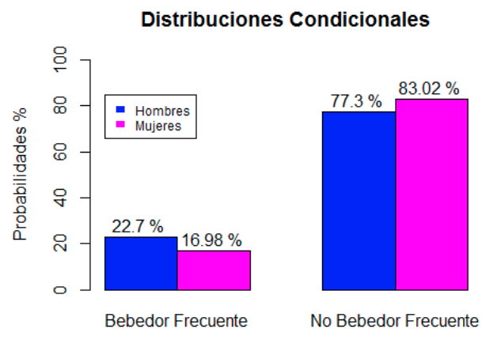
```


# Referencias
1. Altman DG. Practical Statistics for Medical Research. London: Chapman & Hall, 1991.
2. Bland JM, Altman DG. One and two sided tests of significance. BMJ 1994; 309: 248.
3. [Wikieconomica]( https://wikieconomica.com/estadistica-descriptiva/)
4. [Enciclopedia Economica](https://enciclopediaeconomica.com/)
5. [Matemovil](https://matemovil.com/variable-aleatoria-discreta-y-continua/#:~:text=Una%20variable%20aleatoria%20discreta%20es,personas%20que%20aprobaron%20el%20examen.)
 


