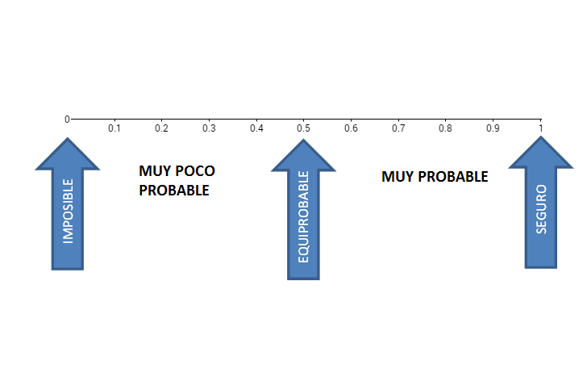
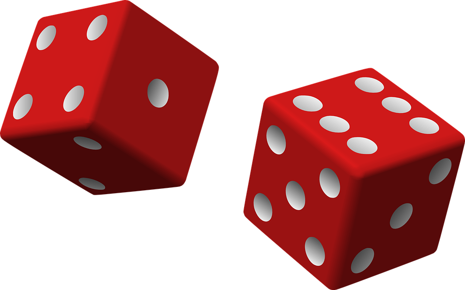
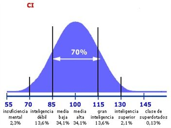
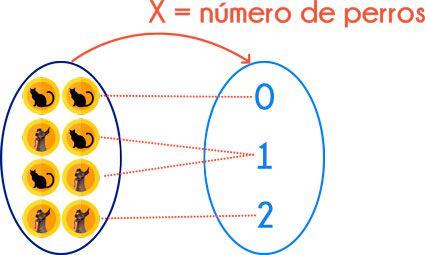
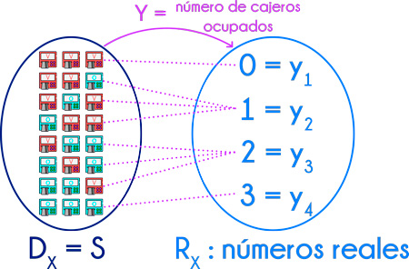
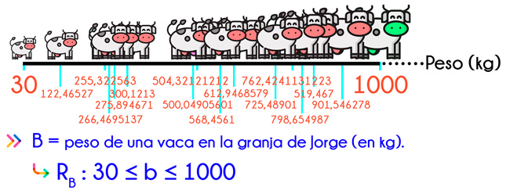
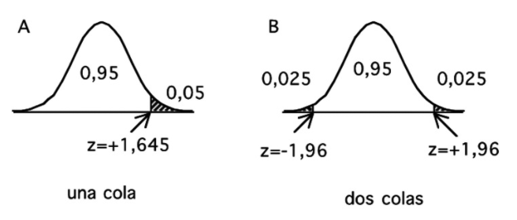
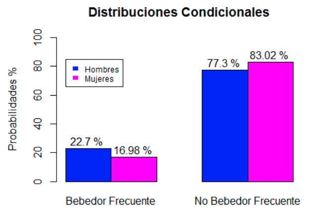

```{r setup, include=FALSE}
bslib::bs_themer()
if (requireNamespace("thematic")) 
  thematic::thematic_rmd(font = "auto")
```

#### [Lizzy Gamboa](https://www.linkedin.com/in/kalizzygam/)

# Hablemos de estadística


```{r echo=FALSE,fig.align='center'}

```


Disciplina que recolecta, organiza, analiza e interpreta datos. Lo hace a través de una población muestral generando estadística descriptiva y estadística inferencial.

  * La [estadística descriptiva](), como su nombre lo indica, se encarga de describir datos y obtener conclusiones. La [estadística inferencial]() argumenta sus resultados a partir de las muestras de una población.
  
  * En la [estadística descriptiva]() se utilizan números, como medidas, para analizar datos y llegar a conclusiones de acuerdo a ellos. Con la [estadística inferencial]() se intenta conseguir información al utilizar un procedimiento ordenado en el manejo de los datos de la muestra.
  
  * Algunos dicen que La estadística inferencial  se encarga de realizar el cálculo de la probabilidad de que algo ocurra en el futuro
  
  
```{r echo=FALSE,fig.align='center'}
knitr::include_graphics("img/estadistica-descriptiva-inferencial.jpeg")
```


# Estadística descriptiva


**El objetivo es comprender los datos recolectados.**


La Estadística Descriptiva es la rama de la Estadística que se encarga de recolectar, organizar, analizar, presentar y sintetizar una información o un conjunto de datos de una población en estudio como edad, sexo, ingresos familiares, entre otros, sin inferir resultados ni conclusiones.

Ordena la información numérica en gráficos utilizando recursos visuales como tablas, diagramas de barras o circulares, histogramas, u otros, que permitan procesar la relación matemática y/o correlación estadística de la data numérica. 

# Tipos de variables estadísticas descriptivas
A través de la Estadística Descriptiva se pueden describir los datos con base en dos variables: la cualitativa y la cuantitativa.

## Variable Cualitativa
Una variable cualitativa es un tipo de variable estadística que describe las cualidades, circunstancias o características de un objeto o persona, sin hacer uso de números.

De esta manera, las variables cualitativas permiten expresar una característica, atributo, cualidad o categoría no númerica. Por ejemplo, el sexo de una persona es una variable cualitativa, ya que es masculino o femenino.


  * No se puede medir numéricamente.
  * No otorga datos específicos y a veces tampoco un orden.
  * Especifica una condición, cualidad o característica.
  * Cuando los valores de dicha variable son solamente dos, se llama dicotómica.
  * Cuando distingue tres valores o más, se la llama politómica.

```{r echo=FALSE,fig.align='center'}

```

### Tipos de variables cualitativas

La variable cualitativa puede ser *nominal, ordinaria o binaria.*

```{r echo=FALSE,fig.align='center'}

```


1. [Nominal]()
Variable que no es representada por números ni tiene algún tipo de orden, y por lo tanto es matemáticamente menos precisa.

Por ejemplo, son variables nominales los colores: negro, azul, rojo, amarillo, naranja, etc.

2. [Ordinaria]()
La variable cualitativa ordinaria, también conocida como variable cuasicuantitativa, es representada por una modalidad que no requiere números pero sí consta de un orden o un puesto.

Por ejemplo, el nivel socioeconómico: alto, medio, bajo.

3. [Binaria]()
La variable cualitativa binaria trabaja con valores específicos del tipo binario.

Por ejemplo, el sexo de una persona será masculino o femenino.


## Variable Cuantitativa

Las variables cuantitativas son aquellas variables estadísticas que otorgan, como resultado, un valor numérico.

Por ejemplo, variables tales como el peso (62 kg, 80 kg), la altura (1,72 cm, 1,85 cm) o la cantidad de miembros en una familia (2, 3 ó 4), son variables cuantitativas.


Las principales características de las variables cuantitativas son las siguientes:

* Expresan sus valores con números.
* Se puede realizar operaciones matemáticas para resumir una información
* Son utilizadas generalmente en encuestas o entrevistas.
* Utilizan gráficos llamados diagramas integrales y diagramas diferenciales para mostrar la frecuencia relativa de las variables.
* También pueden servirse de diagramas de barra para otorgar cifras.


### Tipos de las variables cuantitativas
Las variables cuantitativas pueden ser *discretas o continuas.*

```{r echo=FALSE,fig.align='center'}

```

1. [Discreta]()
La variable discreta otorga cifras que se encuentran separadas en escalas, es decir que no poseen valores entre ellas, sino que el resultado comprende un valor exacto. 

De esta manera, dichas variables solo pueden adquirir un valor en números enteros. Por ejemplo, una persona puede tener 1, 2, 3 o más perros, pero no un perro y medio.

2. [Continua]()
Artículo principal: Variable continua.
La variable continua, por otro lado, puede otorgar un valor de cualquier intervalo o medición, es decir que puede haber otros valores en medio de dos exactos. Generalmente estos son representados por valores decimales, por lo cual la cifra será mucho más específica.

Por ejemplo, la estatura de una persona puede ser de 1,75 centímetros.


## Ejercicio

¿Qué tipo de variables son la siguientes? 

* Cantidad de niños en el aula de una escuela: 20, 30, 40, etc.
* Estado civil: soltero, casado, viudo.
* La sed de una persona: mucha, poca, nada.
* Peso exacto de un niño: 40 kg, 30 kg, etc.
* Grados de alcohol de una cerveza: 5%, 10%, 12%, etc.
* Calificación exacta de un examen universitario: 4, 7, 8, 10, etc.
* Calificación no numérica de un examen: aprobado, sobresaliente, aceptado, reprobado.
* Color de ojos: marrones, azules, verdes.
* Profesión: arquitecto, médico, ingeniero, abogado.
* Cantidad de mascotas que posee una persona: 1, 2, 3, etc.
* Estatus de un credito: Aprobado, denegado. 
* Velocidad con la que se traslada un automóvil: 160 km/h, 100 km/h, etc.
* Valor económico de un producto: $25, $50, $100, etc.

# Aplicaciones

### En la Economía
Registra y organiza con coherencia una amplia información sobre una población como edad, sexo, ingresos y egresos familiares, entre otros aspectos. Esta modalidad facilita a los gobiernos e instituciones la planificación de mejoras e inversiones necesarias.

Puede hacerse seguimiento a compras, ventas, devoluciones y calidad de los servicios, para una oportuna toma de decisiones de cambio o mejoras.

### En Física y Mecánica
Facilita el estudio de los medios continuos de la Física y de la Mecánica por la gran cantidad de partículas (átomos y moléculas), imposibilitando el seguimiento a cada una por separado. 

Desde la perspectiva macroscópica puede evaluarse el comportamiento global de un sistema. Se puede citar como ejemplo el estudio de una porción de gas, para determinar los promedios y las variables para conocer las propiedades.

### En Medicina y/o Ciencias de la Salud
Contribuye a llevar una información ordenada y controlada sobre el origen de enfermedades, período de incubación, evolución, índices de morbilidad y mortalidad de diversas enfermedades, cifras epidemiológicas, así como la eficiencia y eficacia de los tratamientos médicos para distintas patologías.

### En Nutrición
Registra y ordena la información sobre el consumo de alimentos de una población como cantidad, calidad y los alimentos de más alto consumo, entre otros aspectos de interés nutricional, para diseñar planes educativos y de orientación sobre alimentación sana y balanceada.


# Instrumentos o medidas de la estadística descriptiva

Cuando se obtienen los datos de una investigación sobre diferentes variables, es necesario condensar los mismos y resumirlos a través de uno o varios valores que determinen los principales caracteres del fenómeno que se estudia. Las medidas que forman este tipo de métodos estadísticos son las que logran dicho resumen.

Las principales medidas de la estadística descriptiva son las siguientes:

* [Frecuencia](): La frecuencia dispone de los datos para resumir la información, de esta manera frecuencia estadística es la cantidad de veces que se repite una observación durante la realización de un muestreo.

* [Distribución de probabilidad*](): Es como una lista que nos proporciona todos los resultados de los valores que pueden presentarse en un acontecimiento, junto con la probabilidad de ocurrencia asociada a cada uno de estos valores.

* [Medidas de posición o de tendencia central](): se dividen en promedios matemáticos: el aritmético, el geométrico y el armónico; y promedios no matemáticos: la mediana y la moda.

* [Medidas de dispersión](): para las variables cuantitativas, las medidas de dispersión que se pueden identificar son la desviación media, la desviación estándar o desviación típica, los rangos intercuartílicos y los valores mínimos y máximos.

* [Razones, tasas y porcentajes](): son medidas relativas que condensan información sobre la incidencia de una característica entre un grupo de unidades.

* [Información gráfica](): Las tablas y gráficos en la Estadística Descriptiva muestran la información en una forma sencilla y resumida de fácil comprensión.


*NOTA *Las distribuciones de probabilidad son la base de la estadistica inferencial. 

# Frecuencia y su Distribución

La frecuencia estadística es la cantidad de veces que se repite una observación durante la realización de un muestreo. Este concepto suele explicarse junto con un ejemplo que ilustre a qué hace referencia el término frecuencia estadística en cada caso.

Supongamos que se realiza un muestreo aleatorio mediante una encuesta que consta de una sola pregunta y 3 opciones de respuesta, y que la encuesta se hace a un grupo de 20 personas.

Cinco personas responden con la opción 1, diez con la opción 2 y cinco con la opción 3. Recordemos que la frecuencia estadística es la cantidad de veces que se repite una observación; es decir, en este ejemplo, la frecuencia estadística sería de cinco para la opción 1, de diez para la opción 2 y de cinco para la opción 3.

Nótese que la suma de las frecuencias estadísticas, en este caso, es igual al total de personas encuestadas. Esto significa que la frecuencia estadística es la manera en que se distribuyen las respuestas de las personas.

## Tipos de frecuencia estadística
En estadística, podemos identificar 3 tipos de frecuencias: absoluta, relativa, absoluta acumulada.

### Frecuencia absoluta

La frecuencia absoluta es un tipo de frecuencia estadística que se utiliza en una investigación para determinar el número de veces que se repite un valor.

Esta se representa con las letras $n_i$ ó $f_i$ y es utilizada en la estadísticas descriptivas para conocer sus características y cuántas veces se repite en una muestra. Además, la suma de las frecuencias absolutas obtenidas es igual al total de los datos analizados, que se representa con N.

#### Ejemplos

Para entender mejor este concepto, veamos 2 ejemplos de frecuencia absoluta: 

1. [Ejemplo con variable discreta: ]()
  Una consultora decide realizar una investigación en una oficina acerca de la cantidad de hijos que poseen sus empleados. Luego de realizar la pregunta a 20 empleados, las respuestas son las siguientes: 0, 2, 2, 0, 3, 1, 1, 2, 3, 1, 0, 2, 3, 4, 3, 4, 2, 0, 1, 2.
  
  En consecuencia tenemos N = 20 (cantidad de empleados evaluados) y Xi = variable aleatoria.

```{r echo=FALSE,fig.align='center'}

```


A partir de esta información, podemos conocer la cantidad de veces que se repite X variable en una investigación. Además, podemos observar que la suma total de las frecuencias absolutas es igual a N (cantidad de individuos).

2. [Ejemplo con variable continua]()
  ¿Qué pasaría si quisiéramos evaluar la frecuencia absoluta de una variable continua? Es decir, de una variable que posee números exactos en décimales. En este caso entonces, debemos hacer uso de intervalos.
  
  Supongamos que el investigador ahora decide evaluar la altura de los empleados de una organización, por lo que vuelve a consultar a 20 de estos, y obtiene los siguientes resultados: 1,79; 1,90; 1,82; 1,73; 1,66; 1,77; 1,88; 1,71; 1,72; 1,92; 1,84; 1,87; 1,68; 1,78; 1,96; 1,72; 1,76; 1,90; 1,72 y 1,67
  
  En consecuencia, tenemos N = 20 (cantidad de empleados evaluados) y Xi = variable aleatoria.

```{r echo=FALSE,fig.align='center'}

```

Cabe destacar que, en este caso, «[« incluye al número en dicho intervalo, mientras que «)» cierra el número sin incluirlo. Por ejemplo, si el intervalo es [1,90 – 2,00), la estatura 1,90 sí se incluiría, mientras que la estatura 2,00 no estaría incluida en el intervalo.

Por lo tanto, a través de la frecuencia absoluta se podría saber cuál de todas las variables es la que más se repite y a partir de allí sacar conclusiones.


### Frecuencia relativa


La frecuencia relativa es un tipo de frecuencia estadística que se utiliza en la investigación para determinar el número de veces que se repite un valor específico dentro de un conjunto total de valores.

La sumatoria de todas las frecuencias relativas de un conjunto de valores siempre debe ser igual a 1, cuando es expresada en decimales, o igual al 100% cuando es expresada en porcentajes.

A su vez, la frecuencia relativa puede ser expresada como una fracción (4/20), como un número decimal (0,20) o como un porcentaje (20%).

Para el cálculo de la frecuencia relativa se utiliza la siguiente fórmula:

```{r echo=FALSE,fig.align='center'}

```


* Para el cálculo de la frecuencia relativa se requiere tener previamente el valor calculado de la frecuencia absoluta. 

* La suma de las frecuencias relativas corresponde a 1, si se expresa en decimales, o al 100% si se expresa en porcentajes; mientras que la sumatoria de las frecuencias absolutas corresponde al número total de datos.


#### Ejemplos


1. Ejemplo 1

Una consultora decide realizar una investigación acerca de la cantidad de hijos que poseen los empleados de una oficina. Luego de realizar esta pregunta a 20 empleados, las respuestas son las siguientes: 0, 2, 2, 0, 3, 1, 1, 2, 3, 1, 0, 2, 3, 4, 3, 4, 2, 0, 1, 2.

Calculemos la frecuencia relativa:

```{r echo=FALSE,fig.align='center'}

```

2. Supongamos que el investigador ahora decide evaluar la altura de los empleados de la organización, por lo que vuelve a consultar a 20 de estos y obtiene los siguientes resultados: 1,79; 1,90; 1,82; 1,73; 1,66; 1,77; 1,88; 1,71; 1,72; 1,92; 1,84; 1,87; 1,68; 1,78; 1,96; 1,72; 1,76; 1,90; 1,72 y 1,67.


```{r echo=FALSE,fig.align='center'}

```

### Frecuencia acumulada

[*Frecuencia absoluta acumulada*]()
La frecuencia acumulada es aquella que se obtiene al sumar todas las frecuencias absolutas inferiores o iguales al valor en cuestión. Se representa con $N_i$.

[*Frecuencia relativa acumulada*]()
En esta se tiene en cuenta la sumatoria de todas las frecuencias relativas inferiores o iguales al valor en cuestión. Se representa con $F_i$ ó $H_i$ .

#### Ejemplo

Supongamos que se realiza una investigación sobre 15 personas, para determinar la cantidad de mascotas que estas tienen.

Las respuestas analizadas son: 1, 2, 2, 3, 1, 2, 0, 1, 3, 4, 0, 2, 1, 2, 4. Por lo que la tabla de frecuencia estadística quedaría de la siguiente manera:

```{r echo=FALSE,fig.align='center'}

```


# Información gráfica

La distribución de frecuencias es la agrupación de datos en categorías mutuamente excluyentes que indican el número de observaciones en cada categoría, lo cual proporciona un valor añadido a la agrupación de datos recopilados.

De manera ilustrativa, a continuación se muestra un gráfico de frecuencia con las preferencias deportivas de los alumnos de una escuela secundaria, con matrícula de 1.000 estudiantes.grafica

```{r echo=FALSE,fig.align='center'}

```


```{r echo=FALSE,fig.align='center'}

```

# Medidas de posición o de tendencia central

Las tendencias resultantes de las diferentes medidas estadísticas respecto a la media son el reflejo de la estadística descriptiva, ya que mediante el estudio de estos promedios se puede visualizar o cuantificar la descripción de un fenómeno. 

Entonces, al describir observaciones de un grupo con valor típico se hace referencia a las medidas de tendencia central. Por lo general, el promedio característico de un grupo suele localizarse en el centro de dicho grupo, cuando se ordena de forma ascendente o descendente. 

Algunas de estas medidas de tendencia central para describir un fenómeno en estadística son:   

* [Media aritmética:]() es una medida estadística que ofrece una cifra de tendencia central que se obtiene al sumar todos los valores de la tabla de estudio y dividirlos entre la cantidad de observaciones. 

* [Moda:]() se define como el valor que está representado con mayor frecuencia absoluta dentro de un conjunto de observaciones, siendo este número el de máxima repetición dentro de la muestra. Este dato estadístico se puede calcular para variables cuantitativas y variables cualitativas.

* [Mediana:]() es una medida de tendencia central que se calcula al ordenar los valores de la muestra, de forma creciente o decreciente, para identificar la cifra central del número de observaciones; es importante dejar la misma cantidad de cifras tanto de un lado como del otro. 


## Media aritmética o promedio

El mismo se determina al sumar el valor de todos los datos que se tienen. Luego se divide el resultado entre el número total de esos datos.

La media aritmética se calcula de la siguiente manera:

```{r echo=FALSE,fig.align='center'}

```

Fórmula para calcular la media aritmética en la estadística descriptiva.

Con base a la fórmula anterior, la media aritmética para la siguiente serie de cifras se determinaría de esta manera:

Cifras: 5, 9, 10, 12, 16, 19, 22, 27.
media
N = 8 (el número datos).

```{r echo=FALSE,fig.align='center'}

```


## Mediana

Se define esta medida de posición como el valor que divide una distribución de manera que un número igual de términos quede a cada lado.

Según esta definición, para determinar la mediana será necesario ordenar los datos, pudiendo coincidir o no el valor de la mediana con un valor de la serie, dependiendo de ello si el número de datos es impar o par. En el primer caso coincide y en el segundo no.

Si se tiene una serie de valores $X1 + X2 + X3 + …….+ Xn$, dispuesta en orden de menor a mayor, se localiza la mediana como el valor $(N + 1) ÷ 2$, cuando el números de términos $N$  es impar. Cuando $N$ es par, la fórmula sería $(N ÷ 2) + 1.$

### Ejemplos:

Teniendo los valores: 4 + 8 + 12 + 14 + 18, la mediana se localizaría en el valor 12 por ser impar. 5 + 1 = 6 ÷ 2 = 3 (posición 3). Si la serie tiene un número impar de medidas, la mediana será la puntuación central de la misma.

Teniendo los valores: 7 + 8 + 14 + 15 + 18 + 20, en este caso por ser el número de términos par, cualquier número no menor a 14 ni mayor a 15 podrá ser considerado la mediana, ya que no existirán más de N ÷ 2 = 3 observaciones menores que él, ni mayor que él. En estos casos lo normal es tomar el valor 14,5 como mediana, que viene a ser el punto medio entre 14 y 15. 14 + 15 = 29 ÷ 2 = 14,5


## Moda

Se define como el valor de la serie que más se repite, el valor más típico. En una distribución de frecuencia, es el valor alrededor del cual los términos tienden a concentrarse más densamente.

Algunos ejemplos comunes de la moda son: la estatura más corriente, el salario más común, la calificación que más se repite, etc. Es decir que la moda es el punto donde la concentración es máxima.

A modo de ejemplo, a continuación se exponen las estaturas de 12 jugadores que conforman la plantilla de un equipo de baloncesto profesional.


```{r echo=FALSE,fig.align='center'}

```


La moda, es decir, la estatura que más se repite en la nómina de este equipo de baloncesto es de 1,95 mts. (3 veces).


```{r echo=FALSE,fig.align='center'}

```

# Medidas de dispersión

## Definición técnica
Las medidas de dispersión tratan, a través del cálculo de diferentes fórmulas, de arrojar un valor numérico que ofrezca información sobre el grado de variabilidad de una variable.


En otras palabras, las medidas de dispersión son números que indican si una variable se mueve mucho, poco, más o menos que otra. La razón de ser de este tipo de medidas es conocer de manera resumida una característica de la variable estudiada. En este sentido, deben acompañar a las medidas de tendencia central. Juntas, ofrecen información de un sólo vistazo que luego podremos utilizar para comparar y, si fuera preciso, tomar decisiones.

Las medidas de dispersión más conocidas son: el rango, la varianza, la desviación típica y el coeficiente de variación (no confundir con coeficiente de determinación). A continuación veremos estas cuatro medidas.

## Rango
El rango es un valor numérico que indica la diferencia entre el valor máximo y el mínimo de una población o muestra estadística. Su fórmula es:

$$R = Máx_x – Mín_x$$

Donde:

* $R$ → Es el rango.
* Máx → Es el valor máximo de la muestra o población.
* Mín → Es el valor mínimo de la muestra o población estadística.$$ 
* $x$ → Es la variable sobre la que se pretende calcular esta medida.


## Varianza
La varianza es una medida de dispersión que representa la variabilidad de una serie de datos respecto a su media. Formalmente se calcula como la suma de los residuos al cuadrado divididos entre el total de observaciones. Su fórmula es la siguiente:

```{r echo=FALSE,fig.align='center'}

```

* $X$ → Variable sobre la que se pretenden calcular la varianza
* $x_i$ → Observación número i de la variable X. i puede tomará valores entre 1 y n.
* $N$ → Número de observaciones.
* $x̄$ → Es la media de la variable X.

## Desviación estadar (muestral) 

La desviación típica es otra medida que ofrece información de la dispersión respecto a la media. Su cálculo es exactamente el mismo que la varianza, pero realizando la raíz cuadrada de su resultado. Es decir, la desviación típica es la raíz cuadrada de la varianza.


```{r echo=FALSE,fig.align='center'}
knitr::include_graphics("img/Formula-Desviacion-Tipica.jpeg")
```


* $X$ → Variable sobre la que se pretenden calcular la varianza
* $x_i$ → Observación número i de la variable X. i puede tomará valores entre 1 y n.
* $N$ → Número de observaciones.
* $x̄$ → Es la media de la variable X.


# Razones, tasas y porcentajes

## Razon

Se define la razón como el valor que indica la relación cuantitativa entre dos cantidades. Por ejemplo, si en una zona geográfica determinada existen 40.000 niños escolarizados y 10.000 no escolarizados, la razón de escolarizado y no escolarizado vendría expresada por el cociente:

Fórmula ejemplo razón estadística descriptiva.

```{r echo=FALSE,fig.align='center'}

```

De acuerdo con el resultado, se diría entonces que por cada cuatro niños escolarizados, hay un niño no escolarizado.

### Ejemplo

En una frutería hay 25 manzanas y 35 naranjas. ¿Cuál es la razón entre manzanas y naranjas? ¿Y entre naranjas y manzanas? ¿Qué nos indica cada razón?

La razón entre manzanas y naranjas es:

$$ \frac {25}{35} = 0.71$$ 


Lo que indica que el número de manzanas es 0,71 veces el número de naranjas.

Por otro lado, la razón entre naranjas y manzanas es:

$$ \frac {35}{25} = 1.4 $$ 

Lo que indica que el número de naranjas es 1,4 veces el número de manzanas.

*Decir que el número de manzanas es 0,71 veces el número de naranjas y que el número de naranjas es 1,4 veces el número de manzanas es lo mismo.*


## Tasa

En la proporción o tasa, a diferencia del índice anterior, el denominador del cociente es el número total de unidades enunciadas. Tomando el ejemplo anterior para la razón, las proporciones de niños escolarizados y no escolarizados serían:

```{r echo=FALSE,fig.align='center'}

```

```{r echo=FALSE,fig.align='center'}

```

Fórmula para calcular la tasa en la estadística descriptiva.

Fórmula para calcular la tasa en la estadística descriptiva.

Debe observarse que al sumar las dos tasas obtenidas (0,80 + 0,20), el resultado es uno (1), ya que son proporciones complementarias.


## Porcentaje
Como se observa en el ejemplo de la tasa, la solución viene expresada en valores decimales, y si bien desde el punto de vista estadístico no es un inconveniente, usualmente los resultados se presentan en porcentajes. Es por ello que se acostumbra a multiplicar las proporciones por 100, para convertir los valores decimales en porcentajes.


```{r echo=FALSE,fig.align='center'}

```

```{r echo=FALSE,fig.align='center'}

```


# Distribuciónes de probabilidad

La estadística descriptiva que se encarga de organizar, tabular, resumir, graficar y presentar los datos tomados de eventos pasados (encuestas, ventas de un establecimiento, etc.) de manera informativa.

La estadística inferencial que se encarga de realizar el cálculo de la probabilidad de que algo ocurra en el futuro.

En el mundo actual, al momento de tomar una decisión, muy rara vez contamos con la información completa para hacerlo, es por eso que la inferencia estadística juega un papel fundamental en este caso, ya que a partir de una muestra significativa de una población (información limitada), inferimos propiedades de esta población y utilizando la teoría de probabilidades podemos analizar riesgos y reducirlos al mínimo.

```{r echo=FALSE,fig.align='center', out.width='600pt'}
knitr::include_graphics("img/CicloInferencia.jpeg")
```


Los modelos de probabilidad, que son representaciones de la realidad, pueden ayudarnos a optimizar la ganancia de un negocio, optimizar inversiones, optimizar el sistema del servicio al cliente de una compañía creando políticas para evitar la pérdida de clientes, desarrollar mejores programas sociales y políticas públicas y hasta crear nuevas estrategias competitivas a largo plazo según el mercado.


¿qué es exactamente la probabilidad? La probabilidad es un valor entre 0 y 1 que describe la posibilidad de ocurrencia de un acontecimiento


Ahora bien, ¿qué es exactamente la probabilidad? La probabilidad es un valor entre 0 y 1 que describe la posibilidad de ocurrencia de un acontecimiento, dónde  [1 representa que el acontecimiento sucederá muy seguramente y 0 que el acontecimiento con seguridad no sucederá.]()


```{r echo=FALSE,fig.align='center', out.width='600pt'}

```


**Ejemplos: **

```{r echo=FALSE,fig.align='center', out.width='600pt'}

```


```{r echo=FALSE,fig.align='center', out.width='600pt'}
knitr::include_graphics("img/bolasejemplo.png")
```

**¿Qué pasa con las variables continuas? **

Esta gráfica representa los resultados de una encuesta sobre cociente intelectual...


```{r echo=FALSE,fig.align='center', out.width='600pt'}

```


Teniendo presente los conceptos anteriores, podemos definir de una manera no formal una distribución de probabilidad como una lista que nos proporciona todos los resultados de los valores que pueden presentarse en un acontecimiento, junto con la probabilidad de ocurrencia asociada a cada uno de estos valores.

Y para poder tener una distribución de probabilidad debemos tener una [Variable Aleatoria]() 

## Variable Aleatoria

Una variable aleatoria es una función que asigna un valor numérico, al resultado de un experimento aleatorio. Una variable aleatoria puede ser discreta o continua. Las variables aleatorias discretas son aquellas que presentan un número contable de valores; por ejemplo, el número de personas que viven en una casa (pueden ser 3, 5 o 9). Las variables aleatorias continuas son aquellas que presentan un número incontable de valores; por ejemplo, el peso de las vacas en una granja (una vaca puede pesar 632,12 kg, otra puede pesar 583,12312 kg, otra 253,12012 kg, otra 198,0876 kg y nunca terminaríamos de enumerar todos los posibles valores). Como estas definiciones son muy difíciles de entender a simple vista, vamos a explicarlas a detalle.


Una variable aleatoria es una función que asigna un valor numérico, al resultado de un experimento aleatorio. Recordemos que el resultado de un experimento aleatorio depende del azar. Veamos los ejemplos.


### Ejemplo 1: Variable discreta


Tenemos una moneda que en sus caras tiene por un lado un gato y por el otro, un perro.


```{r echo=FALSE,fig.align='center', out.width='500pt'}
knitr::include_graphics("img/VA1_1.jpeg")
```

Vamos a realizar un experimento aleatorio que consiste en lanzar 2 monedas. Colocaremos los resultados en el siguiente gráfico:

```{r echo=FALSE,fig.align='center', out.width='500pt'}

```

Definimos nuestra variable aleatoria X:

$X$ = número de perros.

```{r echo=FALSE,fig.align='center', out.width='500pt'}

```


Ten en cuenta que la variable aleatoria siempre va con letras mayúsculas (en este caso X), mientras que los valores de su rango siempre con letras minúsculas (en este caso x1  , x2 , x3).

```{r echo=FALSE,fig.align='center', out.width='500pt'}
knitr::include_graphics("img/VA1_4.jpeg")
```


Los valores del rango de esta variable aleatoria son:

* $x_1$ = 0
* $x_2$ = 1
* $x_3$ = 2


En el dominio de la función tenemos el espacio muestral, es decir, todos los resultados posibles de nuestro experimento aleatorio. Mientras que el rango tenemos un conjunto de números reales.


### Ejemplo 2: Variable discreta 

En un banco hay 3 cajeros automáticos. Vamos a realizar un experimento aleatorio que consiste en ir al banco a una hora al azar del día y ver qué cajeros están ocupados y qué cajeros están vacíos.

Colocamos en el siguiente gráfico los resultados, los cajeros vacíos (V) irán de color rojo y los ocupados (O) de color verde.


```{r echo=FALSE,fig.align='center', out.width='500pt'}
knitr::include_graphics("img/VA2_1.jpeg")
```


Definimos nuestra variable aleatoria Y:

* $Y$ = número de cajeros automáticos ocupados.

```{r echo=FALSE,fig.align='center', out.width='500pt'}
knitr::include_graphics("img/VA2_2.jpeg")
```


Ten en cuenta que la variable aleatoria siempre va con letras mayúsculas (en este caso Y), mientras que los valores de su rango siempre con letras minúsculas (en este caso  $y_1  , y_2 , y_3, y_4$ ).

```{r echo=FALSE,fig.align='center', out.width='500pt'}

```


Los valores del rango de esta variable aleatoria son:

* $y_1$ = 0
* $y_2$ = 1
* $y_3$ = 2
* $y_4$ = 3

Las variables aleatorias se clasifican en discretas o continuas en función de los valores numéricos que asumen. Veamos esto a detalle. 


### Ejemplo 1: Variable continua 


Una variable aleatoria continua, es aquella que puede asumir un número incontable de valores.

Por ejemplo, si realizamos el experimento de ir a mi granja y estudiamos las características de las vaquitas, podemos definir la variable aleatoria C:

* $B$ = peso de una vaca en la granja de Jorge (en kilogramos).

Alguna vaquita puede pesar 425,1872 kg; otra puede pesar 612,5874541 kg; otra puede pesar 545,897512121 kg. Si tomamos más vacas, podríamos tener más valores y nunca terminaríamos. 

Se conoce que el becerro más pequeño tiene un peso de 30 kg, y la vaca más grande tiene un peso de 1000 kg.

```{r echo=FALSE,fig.align='center', out.width='600pt'}

```


Y así, tendríamos un número incontable de valores para el rango de esta variable. El rango de esta variable puede ser cualquier valor dentro del intervalo que va desde 30 kg hasta 1000 kg. 

Por ello, se trata de una variable aleatoria continua. 


### Ejemplo 2: Variable continua 

Si vamos a una agencia del banco y registramos los datos de atención a los clientes, podemos definir la variable aleatoria... Si! Tambien esto lo podemos volver una variable aleatoria. 


* $D$ = tiempo de atención a los clientes del banco (en segundos).


Un cliente puede ser atentido en 24,123 s; otro cliente en 72,32142 s; otro en 51,123123 s. Si seguimos tomando más clientes, tendríamos más valores. Se conoce además que el tiempo mínimo de atención en ventanilla es de 1 s y el tiempo máximo es de 240 s.

```{r echo=FALSE,fig.align='center', out.width='600pt'}
knitr::include_graphics("img/VA3_2.jpeg")
```


Y así, tendríamos un número incontable de valores para el rango de esta variable. El rango de esta variable puede ser cualquier valor dentro del intervalo que va desde 1 s hasta 240 s. Por ello, se trata de una variable aleatoria continua. 

En general, las variables aleatorias discretas representan datos que provienen del conteo del número de elementos, mientras que, las variables aleatorias continuas representan datos que provienen de mediciones, por ejemplo, tiempo, peso, longitud, etc. 


Ahora que hemos entendido lo que es una variable aleatorio y lo que hace una función de probabilidad, podemos hablar de familias paramétricas :D 


# Familias Paramétricas


# Pruebas de hipótesis

Una hipótesis es una **proposición que puede o no ser verdadera** pero que se adopta provisionalmente hasta recabar información que sugiera lo contrario. Si hay inconsistencia, se rechaza la hipótesis. Las pruebas de hipótesis se usan precisamente para **evaluar el grado de esa inconsistencia**.


Se puede describir formalmente los pasos a seguir:

#### Formular la hipótesis y su alternativa ($H_0 \quad Vs \quad H_1$):

Normalmente la hipótesis de trabajo (por ejemplo, tal tratamiento es mejor que el control o tal procedimiento tiene menos morbilidad) es contrastada con una hipótesis estadística que supone que no existe tal efecto o tal diferencia. La razón para hacer esto es que se puede calcular de antemano la distribución de probabilidades asociadas con tal situación. Esta hipótesis se conoce con el nombre de hipótesis nula que se abrevia como $H_0$ (Nullus: Nula, falto de valor y fuerza para obligar o tener efecto). La expresión matemática es $H_0: \mu_1 = \mu_2$ La hipótesis alternativa es que el efecto sí existe, que es distinto de cero, y que en algunos casos se puede especificar el signo de esa diferencia. Normalmente corresponde a la hipótesis de trabajo, se abrevia como $H_1$ y tiene tres alternativas: 

* $\mu_1 \neq \mu_2$
* $\mu_1<\mu_2$
* $\mu_1>\mu_2$

#### Determinar prueba adecuada

Elegir la prueba estadística apropiada de acuerdo al diseño experimental, el tipo de datos y el número de grupos que se comparan. La cifra que resulta de usar la prueba (aplicar la o las fórmulas) en los datos recolectados se conoce como el estadístico del test en cuestión: **z**; estadístico **t** o t de Student, la **r** de Pearson, **F** del análisis de varianza. La distribución del estadístico puede ser calculada de antemano cuando la $H_0$ es verdadera y por lo tanto conocer los valores que delimitarán distintas porciones del área bajo la curva de esa distribución; éstas se conocen como distribuciones de muestreo. Vale la pena decir aquí, y lo reiteraremos luego, que **las pruebas de hipótesis en ningún caso prueban la veracidad de la hipótesis alternativa o de trabajo**, limitándose a decir que no hay suficiente evidencia para rechazar la hipótesis nula basándose en un nivel preestablecido de probabilidades.

#### Elegir el nivel de significancia $\alpha$

Se trata del límite tolerado para rechazar $H_0$. En general, se usa $\alpha=0.01, \quad \alpha=0.05 \quad ó \quad \alpha=0.1$, cifras que implican un 1%, 5% o un 10% respectivamente, de posibilidades de equivocarse cuando se rechaza $H_0$, de decir que hay una diferencia cuando en realidad no la hay. Este es el llamado **error tipo I**.

#### Calcular el valor de P (p-value)
Esta es la **probabilidad de obtener los resultados observados u otros más extremos** si la $H_0$ es verdadera, cifra que es determinada por el área de la distribución que queda más allá del valor calculado.

#### Decisión

Si $p < \alpha$, rechazar $H_0$ en favor de la alternativa; en caso contrario, no se rechaza la hipótesis nula. El conjunto de valores que resultarían en el rechazo de $H_0$ – calculados conociendo la prueba usada, $\alpha$ y el número de observaciones – se conoce con el nombre de **región crítica**. Este punto puede refrasearse así: "**Se rechaza la $H_0$ si el estadístico cae en la región crítica"**. En los apéndices de los textos de estadística aparecen tablas con la distribución de estos estadísticos, dando el valor de **p** (p-value) y donde el tamaño de la muestra se considera en los grados de libertad.

```{r echo=FALSE,fig.align='center'}

```

Como se evalúa el estadístico calculando la probabilidad de observar el valor encontrado u otro más extremo, el valor de P constituye la cola de la distribución. Este concepto es importante pues permite entender qué significa un test de una cola o de dos colas. 

Si la hipótesis de trabajo implica que existe una diferencia, sin especificar la dirección de esa diferencia ($\mu_1 \neq \mu_2$) debe usarse una prueba de dos colas. Si se es capaz de especificar de antemano el signo de ella ($\mu_1 < \mu_2$ o bien $\mu_1 > \mu_2$), se puede y se debe usar una prueba de una cola. 

El punto es importante pues el área crítica es mayor en este último caso lo que equivale a decir que se puede rechazar con un valor menor del estadístico. 

## Errores de un test de hipótesis

Frente a dos posibilidades reales, no hay diferencias ($H_0$) o bien sí las hay ($H_1$), las pruebas de hipótesis pueden dar dos resultados: rechazar o aceptar $H_0$. En estas circunstancias, en forma análoga a lo que sucede con los exámenes de laboratorio diagnósticos, las alternativas son cuatro. Dos no constituyen más que la coincidencia entre la realidad y el resultado de las pruebas:

1. Se rechaza $H_0$ cuando ésta es falsa, una diferencia verdadera es declarada estadísticamente significativa. Es un verdadero positivo.

2. Se acepta $H_0$ cuando ésta es verdadera, no hay una diferencia estadísticamente significativa y en realidad no la hay. Un verdadero negativo.

Las otras alternativas implican una incongruencia entre la realidad y los resultados y, por lo tanto, constituyen errores.

1. Se rechaza $H_0$ cuando ésta es verdadera, concluyendo que hay una diferencia que en realidad no existe, un falso positivo. Se ha cometido un error que se denomina de tipo I. 

2. No se rechaza $H_0$ cuando en realidad es falsa, un falso negativo, concluyendo que no hay diferencia cuando en realidad existe. Este es el error tipo II (β), que la mayoría de las veces se debe a un tamaño insuficiente de la muestra. 

Estos dos errores deben ser considerados al evaluar el resultado de un trabajo de investigación que haya empleado pruebas de hipótesis, considerando la posibilidad de un error I cuando los resultados son significativos y de un error tipo II cuando son no significativos. 

## Ejemplo completo: 
#### Distribución de probabilidad asociada a una tabla de contingencia

Consideremos únicamente una tabla de 2x2 con la relación que existe entre sexo y ser o no bebedor frecuente. La tabla es la siguiente:

|         |       Bebedor frecuente |       |
|---------|------|-------------------|-------|
| Sexo    | Sí   | No                | Total |
| Hombres | 1630 | 5550              | 7180  |
| Mujeres | 1684 | 8232              | 9916  |
| Total   | 3314 | 13782             | 17096 |

La primera de nuestras tablas corresponde a la **Distribución conjunta**:

En este caso tenemos dos variables categóricas, **X** (Sexo) y **Y** (Bebedor frecuente), con I=2 y J=2 categorías, respectivamente. Su distribución conjunta es la probabilidad de que un sujeto seleccionado aleatoriamente obtenga un valor en el renglón *i* y la columna *j*. Esto nos genera la tabla de probabilidad conjunta dada por:

|         | Bebedor frecuente |
|---------|------|-------------------|
| Sexo    | Sí   | No                |
| Hombres | $\pi_{11}$ | $\pi_{12}$              |
| Mujeres | $\pi_{21}$ | $\pi_{22}$              |

La forma de estimar estas probabilidades es:

$$\pi_{ij}=\frac{n_{ij}}{n}; \quad i,j=1,2$$

Con lo que generamos la tabla:

|         | Bebedor frecuente |
|---------|------ |-----------|
| Sexo    | Sí    | No        |
| Hombres | 0.095 | 0.325     |
| Mujeres | 0.099 | 0.482     |

Podemos interpretar las probabilidades anteriores como sigue: "De la muestra realizadas, la probabilidad estimada de que una mujer no sea bebedora frecuente es $\pi_{22}=0.482=48.2%$".

La segunda tabla a analizar corresponde a la **distribución marginal**

Las distribuciones marginales son las sumas por renglón o por columna conjuntas. En concreto:

$$\pi_{i.}=\pi_{i1}+\pi_{i2}=\sum_j\pi_{ij} \quad y \quad \pi_{.j}=\pi_{1j}+\pi_{2j}=\sum_i\pi_{ij}; \quad i,j=1,2$$
Con la tabla de distribuciones dada por:

|         |       Bebedor frecuente |       |
|---------|------|-------------------|-------|
| Sexo    | Sí   | No                | Total |
| Hombres | $\pi_{11}$ | $\pi_{12}$              | $\pi_{1.}$  |
| Mujeres | $\pi_{21}$ | $\pi_{22}$              | $\pi_{2.}$  |
| Total   | $\pi_{.1}$ | $\pi_{.2}$             | 1 |

Además tenemos que las sumas de todas las celdas en la distribución conjunta, es igual a la unidad, así como la suma se las probabilidades marginales de las filas o las columnas.

$$\sum_{i}\pi_{i.}=\sum_{j}\pi_{.j}=\sum_i\sum_j\pi_{ij}=1$$
Con nuestros datos esta tabla queda como:

|         |       Bebedor frecuente |       |
|---------|------|-------------------|-------|
| Sexo    | Sí   | No                | Total |
| Hombres | 0.095 | 0.325              | 0.42  |
| Mujeres | 0.099 | 0.482              | 0.58  |
| Total   | 0.194 | 0.806             | 1 |

La última de las distribuciones asociada a una tabla de contingencia son las **distribuciones condicionales**. 

Cuando una de las variables de respuesta (**Y**) y la otra es explicativa (**X**), entonces es conveniente saber cuál es la distribución de probabilidad de la respuesta, **Y**, para cada nivel de la variable explicativa, **X**, Estas distribuciones consisten en probabilidades condicionales de **Y**, dado su nivel de **X**, y se conocen como distribuciones condicionales.

El conjunto de probabilidades ${\pi_{1|i}, \pi_{2|i}}$ constituyen la distribución conjunta condicional de **Y** en cada categoría de *i* de **X**. La tabla de distribuciones es la siguiente:

|         | Bebedor frecuente |
|---------|------|-------------------|
| Sexo    | Sí   | No                |
| Hombres | $\pi_{1|1}$ | $\pi_{1|2}$              |
| Mujeres | $\pi_{2|1}$ | $\pi_{2|2}$              |

Estas probabilidades estimadas están dadas por:

$$\hat{\pi}_{j|i}=\frac{\hat{\pi}_{ij}}{\hat{\pi}_{i.}}=\frac{\frac{n_{ij}}{n}}{\frac{n_{i.}}{n}}=\frac{n_{ij}}{n_{i.}} \quad i,j=1,2$$
En nuestro caso, esta tabla queda de la siguiente forma

|         | Bebedor frecuente | |
|---------|------|-------------------|--|
| Sexo    | Sí   | No                | Total  |
| Hombres | 0.2270195 | 0.7729805  | 1 |
| Mujeres | 0.1698265 | 0.8301735  | 1 |

Es interesante ver que los hombres (condicional hombres) tienen una probabilidad estimada mayor a ser bebedores frecuentes que las mujeres (condicional mujer). Observemos también que las distribuciones condicionales por sexo, no son muy diferentes. No obstante, aún no tenemos elementos para decidir de manera formal si son o no diferentes.

```{r echo=FALSE,fig.align='center'}

```


# Referencias
1. Altman DG. Practical Statistics for Medical Research. London: Chapman & Hall, 1991.
2. Bland JM, Altman DG. One and two sided tests of significance. BMJ 1994; 309: 248.
3. [Wikieconomica]( https://wikieconomica.com/estadistica-descriptiva/)
4. [Enciclopedia Economica](https://enciclopediaeconomica.com/)
 


